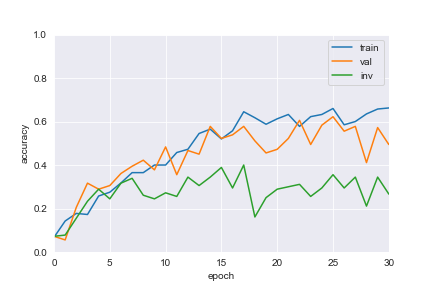
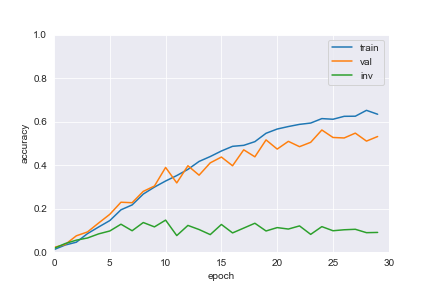

# Face Inversion Effect in CNNs

_Final project for PSYCH 250_  
_Yatharth Agarwal and Julia Jorgensen_


## Brief description of network

We fine-tuned a SqueezeNet model on the CelebA dataset to classify the identity of the celebrity in a given head shot. SqueezeNet is a CNN-based architecture introduced in 2012 that achieves AlexNet-level accuracy on ImageNet with 50x fewer parameters [1]. CelebA is a dataset collected by the The Chinese University of Hong Kong of celebrity headshots, annotated with their identity, bounding boxes for facial parts, and various characteristics [2].

We chose SqueezeNet due to the compact parameter size. To avoid training from scratch, we used pre-trained weights from training on ImageNet and fine-tuned them using the SGD optimiser. We chose CelebA because it was a freely-available database of clear and aligned face images.

The network was trained on primarily (but not entirely) upright headshots of celebrities, and its performance was evaluated on unseen headshots of the same celebrities, in upright form and in inverted form. 


## What code was off-the-shelf and what code we developed

We consulted official PyTorch documentation heavily, in particular the examples on fine-tuning Torchvision models [3]. Any other code was written by us.


## Goal of testing

We wanted to test a potential signature of development in a DNN. Specifically, we decided to examine the Face Inversion Effect. Human infants begin to show the Face Inversion Effect behaviorally within their first years of life [4], and human brains increasingly show preferences to upright faces over inverted faces as we mature into adulthood [5]. We wanted to know whether a DNN would show an analogous learning trajectory. Such an analogue would appear as a gap that emerges early between the network's performance in identifying upright headshots and the network's performance in identifying inverted headshots. We were especially interested in when such a gap would emerge, and how it would evolve as the network approached maturity or convergence.

Humans mainly see upright faces in our daily lives; our training protocol was meant to approximate this experience by training the network on primarily upright images.

## What was the outcome you measured (performance)

We first trained the network on 20 classes (20 different identities). The network approached convergence in 30 epochs, with accuracy on upright shots stabilising to around 50% compared to the random chance baseline of 5%. This accuracy is measured on validation data not used in training.

Interestingly, the accuracy on inverted shots initially tracked the accuracy for upright shots until around epoch 5, and then it plateaued around 30%. In other words, the gap in performance on inverted faces emerged early in the development of the network, and further improvements in classifying upright shots did not translate into further improvements on classifying inverted shots. This can be seen in the figure below.



We tried variations, like changing the optimizer and number of classes, and found similar results. In particular, when we trained the network on 100 classes (five times as much data for training and evaluating performance than before), we found a similar pattern: Convergence was approached in 30 epochs, with accuracy on upright shots stabilising to 50% compared to the random chance baseline of 1%. Accuracy on inverted shots initally tracked the accuracy of upright shots until about epoch 5, then plateaued at 10%. Again, further improvements to accuracy on upright shots did not improve accuracy on inverted shots. See the figure below.




## How to run the code

The project is implemented in a Jupyter notebook using PyTorch and tested on Python 3.8.

To install the requirements, navigate to the project directory and run:

```
pip install pip-tools
pip-compile
pip-sync
```

Creating a virtual environment is recommended. Having installed the requirements, you can run `jupyter lab` to open up a browser tab and launch the notebooks in the `src/` folder. There are two notebooks:

- `with_20_classes.ipynb`
- `with_100_classes.pynb`

They have the same code; the only difference is the latter uses 100 classes instead of 20 classes (and thus trains and evaluates performance on 5 times as much data).

The first run of the notebooks may take longer than usual to download the CelebA dataset to your computer. The notebook with 100 classes takes a long time; a GPU is advised, and if there is one, the GPU will be used.


## Work done by each team member

The work was done through pair coding, research, and collaborative writing. For fine-tuning the SqueezeNet model and evaluating its performance, Yatharth contributed more of his prior experience in machine learning, whereas for researching the neuroscientific background on the Face Inversion Effect to determine the goal and performance measures, Julia contributed her prior background in neuroscience. 

<!-- Yatharth had the stronger machine learning background and Julia had a strong neuroscience background, so Yatharth took the lead on coding and Julia took the lead on research and presentation. Yatharth fine-tuned the SqueezeNet model and evaluated its performance, Julia researched the neuroscience background of the face inversion effect to guide what the goal and performance measures should be. She also created the presentation. Both Yatharth and Julia were involved in deciding the goals of the project and determining the training sets, testing sets, and performance measures to use. -->


## Works Cited

1. [SqueezeNet: AlexNet-level accuracy with 50x fewer parameters and <0.5MB model size](https://arxiv.org/abs/1602.07360)
2. [Large-scale CelebFaces Attributes (CelebA) Dataset](http://mmlab.ie.cuhk.edu.hk/projects/CelebA.html)
3. [Finetuning Torchvision Models](https://pytorch.org/tutorials/beginner/finetuning_torchvision_models_tutorial.html)
4. [Developmental origins of the face inversion effect.](10.1016/bs.acdb.2014.11.008.)
5. [Developmental differences in the neural bases of the face inversion effect show progressive tuning of face-selective regions to the upright orientation.](https://doi.org/10.1016/j.neuroimage.2006.07.045)
